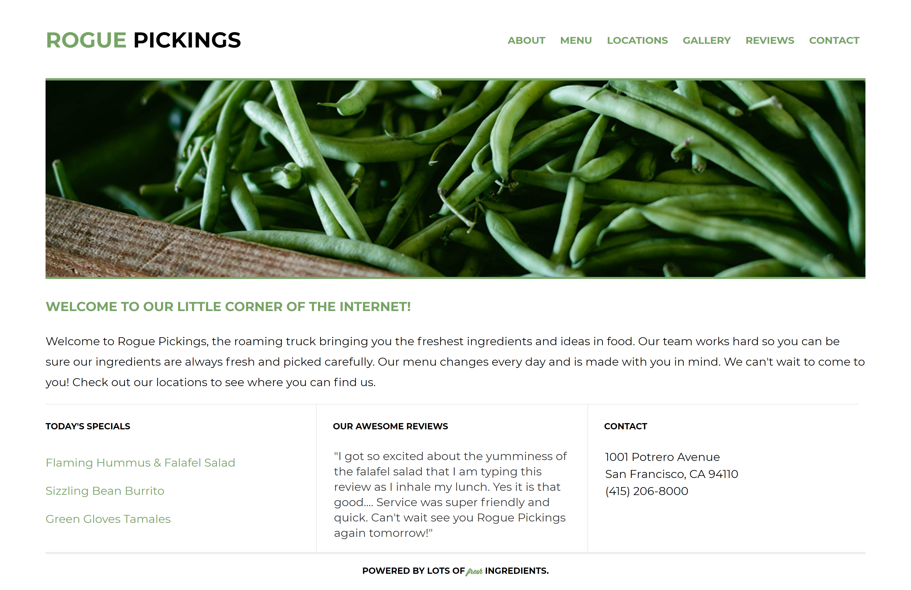

# ROUGE PICKINGS

Rogue Pickings website is a restaurant website that delivers good fresh and affordabe menu selections that will leave your taste buds craving for more

## Languages used
1. Html
2. CSS
## Visuals

## Installation
clone the respository using the link below:
https://github.com/SubiraMbula/-Rogue-Pickings-Website.git

## Contact and Support
-EMAIL -[subbysav123@gmail.com]

## Roadmap
Future ideas and improvements include adding a gallery page and more user interactions on the webpage.

## Author
Subira Mbula

## license
This project is licensed under the MIT License - see the [LICENSE](LICENSE) file for details.

